# 📱 MustDo — Complete Application Documentation

> **Package:** `com.example.todo`
> **App Name:** MustDo
> **Version:** 1.0 (`versionCode = 1`)
> **Min SDK:** 26 (Android 8.0 Oreo)
> **Target SDK:** 36

---

## 📑 Table of Contents

1. [Tech Stack & Dependencies](#-tech-stack--dependencies)
2. [Architecture Overview](#-architecture-overview)
3. [Project Structure](#-project-structure)
4. [Database Schema (Room)](#-database-schema-room)
5. [DataStore Preferences](#-datastore-preferences)
6. [Navigation System](#-navigation-system)
7. [Screens & Pages — Deep Dive](#-screens--pages--deep-dive)
   - [Dashboard Screen](#1-dashboard-screen)
   - [Tasks Screen](#2-tasks-screen)
   - [Add/Edit Task Screen](#3-addedit-task-screen)
   - [Calendar Screen](#4-calendar-screen)
   - [Focus Screen](#5-focus-screen)
   - [Settings Screen](#6-settings-screen)
8. [Gamification System](#-gamification-system)
9. [Notification System](#-notification-system)
10. [Backup & Restore System](#-backup--restore-system)
11. [Dependency Injection (Hilt)](#-dependency-injection-hilt)
12. [Theming System](#-theming-system)
13. [Reusable UI Components](#-reusable-ui-components)
14. [Background Workers](#-background-workers)
15. [Complete Data Flow Diagram](#-complete-data-flow-diagram)

---

## 🧰 Tech Stack & Dependencies

| Layer | Technology | Version / Notes |
|---|---|---|
| **Language** | Kotlin | JVM Target 17 |
| **UI Framework** | Jetpack Compose | Latest via BOM |
| **Design System** | Material Design 3 | `material3` |
| **Architecture** | MVVM + Clean Architecture | Feature-based modularization |
| **DI Framework** | Hilt (Dagger) | `hilt.android` + KSP |
| **Database** | Room | Local SQLite with `exportSchema = true` |
| **Preferences** | Jetpack DataStore | `datastore-preferences` |
| **Navigation** | Navigation Compose | Type-safe navigation |
| **Background Work** | WorkManager | Periodic & one-time workers |
| **Async** | Kotlin Coroutines + Flow | `coroutines-core`, `coroutines-android` |
| **Serialization** | Gson | JSON backup import/export |
| **Charts** | Vico Charts | `vico-compose-m3` |
| **Audio Capture** | MediaRecorder | Capturing voice notes as AAC/M4A |
| **Audio Playback** | MediaPlayer | Seekable audio player with duration tracking |
| **Animations** | Compose Animation | Custom transitions, color lerping |
| **Build System** | Gradle KTS + KSP | Version catalogs |
| **Minification** | R8/ProGuard | Enabled in release builds |

### Dependency Graph

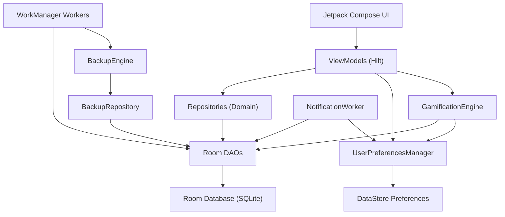

---

## 🏗️ Architecture Overview

The app follows a **feature-based Clean Architecture** pattern with three logical layers per feature:

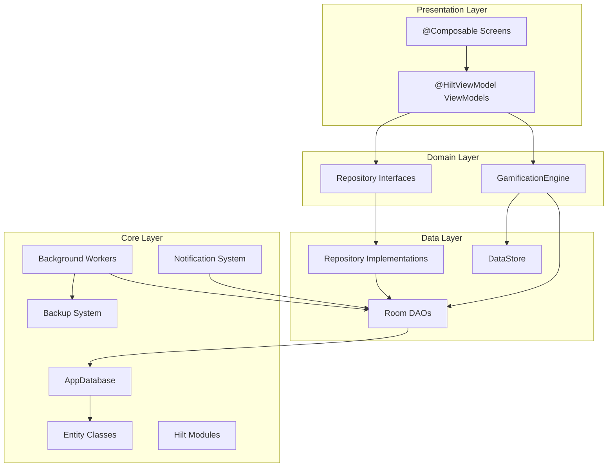

### Layer Responsibilities

| Layer | Responsibility |
|---|---|
| **Presentation** | `@Composable` screens + `@HiltViewModel` ViewModels holding `UiState` via `StateFlow` |
| **Domain** | Repository interfaces, `GamificationEngine` business logic |
| **Data** | Repository implementations, Room DAOs, DataStore access |
| **Core** | Database definition, entities, DI modules, backup, notification, workers |

---

## 📁 Project Structure

```
com.example.todo/
├── MainActivity.kt               # Entry point, theme setup, Scaffold + BottomNav
├── MustDoApplication.kt           # @HiltAndroidApp, schedules alarms + periodic backup
│
├── common/
│   ├── components/
│   │   └── CommonComponents.kt    # TaskCard, StatCard, CircularProgressRing, EmptyState, SectionHeader
│   ├── theme/
│   │   ├── Color.kt               # MustDoColors object (Primary, Accent, Priority colors, etc.)
│   │   ├── Theme.kt               # MustDoTheme (Light + Dark color schemes)
│   │   └── Type.kt                # Typography definitions
│   └── util/
│       ├── DateUtils.kt           # Date formatting, greeting, start/end of day
│       └── StringUtils.kt         # capitalizeFirstLetter()
│
├── core/
│   ├── backup/
│   │   ├── BackupEngine.kt        # Export/restore logic with emergency rollback
│   │   ├── BackupInfo.kt          # Metadata data class for backup files
│   │   ├── BackupManager.kt       # Auto-backup, history management, rotation
│   │   ├── BackupMigrationManager.kt  # Version migration for backup payloads
│   │   ├── BackupPayload.kt       # JSON payload structure for backup/restore
│   │   ├── BackupRepository.kt    # Assembles & restores backup data from all DAOs
│   │   └── BackupValidator.kt     # Checksum, FK, and uniqueness validation
│   ├── database/
│   │   ├── AppDatabase.kt         # Room database (v3, 8 entities, 8 DAOs)
│   │   ├── dao/                   # TaskDao, SubTaskDao, CategoryDao, FocusSessionDao, AchievementDao, TaskResourcesDaos (TaskResourceDao, TaskNoteBlockDao, TaskActivityDao)
│   │   └── entity/                # TaskEntity, SubTaskEntity, CategoryEntity, FocusSessionEntity, AchievementEntity, TaskResourceEntity, TaskNoteBlockEntity, TaskActivityEntity
│   ├── datastore/
│   │   └── UserPreferencesManager.kt  # All user preferences via DataStore
│   ├── di/
│   │   ├── DatabaseModule.kt      # Room DB + DAO providers + default seed data
│   │   └── RepositoryModule.kt    # Repository binding (interface → impl)
│   ├── notification/
│   │   ├── TaskNotificationReceiver.kt  # BroadcastReceiver for alarms + actions
│   │   └── TaskNotificationWorker.kt    # WorkManager worker for summary/individual notifications
│   └── worker/
│       ├── BackupWorker.kt        # Daily periodic backup via WorkManager
│       └── StreakCheckWorker.kt    # Streak validation worker
│
├── features/
│   ├── calendar/
│   │   └── presentation/
│   │       ├── CalendarScreen.kt
│   │       └── CalendarViewModel.kt
│   ├── dashboard/
│   │   └── presentation/
│   │       ├── DashboardScreen.kt
│   │       └── DashboardViewModel.kt
│   ├── focus/
│   │   ├── data/                  # FocusRepositoryImpl (not shown, standard impl)
│   │   ├── domain/
│   │   │   └── FocusRepository.kt
│   │   └── presentation/
│   │       ├── FocusScreen.kt
│   │       └── FocusViewModel.kt
│   ├── gamification/
│   │   └── domain/
│   │       └── GamificationEngine.kt  # XP, levels, streaks, achievements
│   ├── settings/
│   │   ├── data/                  # CategoryRepositoryImpl
│   │   ├── domain/
│   │   │   └── CategoryRepository.kt
│   │   └── presentation/
│   │       ├── SettingsScreen.kt
│   │       └── SettingsViewModel.kt
│   └── tasks/
│       ├── data/
│       │   └── TaskRepositoryImpl.kt
│       ├── domain/
│       │   └── TaskRepository.kt
│       └── presentation/
│           ├── AddEditTaskScreen.kt
│           ├── AddEditTaskViewModel.kt
│           ├── TasksScreen.kt
│           └── TasksViewModel.kt
│
└── navigation/
    ├── MustDoNavHost.kt           # NavHost with all route composables
    └── Screen.kt                  # Sealed class routes + BottomNavItem definitions
```

---

## 🗄️ Database Schema (Room)

**Database Name:** `mustdo_database`
**Version:** 3
**Export Schema:** `true`

### Entity-Relationship Diagram

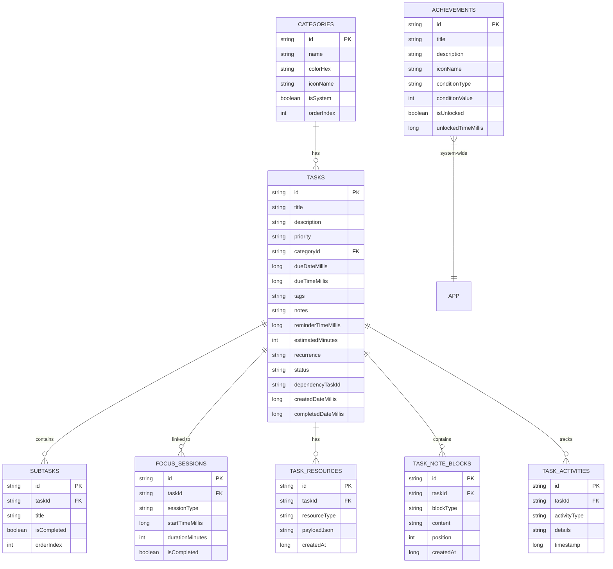

---

### Table: `tasks`

| Column | Type | Default | Nullable | Description |
|---|---|---|---|---|
| `id` | `TEXT` (PK) | UUID | No | Unique task identifier |
| `title` | `TEXT` | — | No | Task title |
| `description` | `TEXT` | `""` | No | Detailed description |
| `priority` | `TEXT` | `MEDIUM` | No | `LOW`, `MEDIUM`, `HIGH`, `URGENT` |
| `categoryId` | `TEXT` (FK → categories.id) | `null` | Yes | Category reference (SET_NULL on delete) |
| `dueDateMillis` | `INTEGER` | `null` | Yes | Due date timestamp |
| `dueTimeMillis` | `INTEGER` | `null` | Yes | Due time timestamp |
| `tags` | `TEXT` | `""` | No | Comma-separated tags |
| `notes` | `TEXT` | `""` | No | Additional notes |
| `reminderTimeMillis` | `INTEGER` | `null` | Yes | Reminder timestamp |
| `estimatedMinutes` | `INTEGER` | `null` | Yes | Time estimate in minutes |
| `recurrence` | `TEXT` | `NONE` | No | `NONE`, `DAILY`, `WEEKLY`, `MONTHLY` |
| `status` | `TEXT` | `PENDING` | No | `PENDING`, `IN_PROGRESS`, `COMPLETED`, `ARCHIVED` |
| `dependencyTaskId` | `TEXT` | `null` | Yes | Dependency on another task |
| `createdDateMillis` | `INTEGER` | `currentTimeMillis()` | No | Creation timestamp |
| `completedDateMillis` | `INTEGER` | `null` | Yes | Completion timestamp |

**Indices:** `categoryId`, `dueDateMillis`, `status`, `priority`, `createdDateMillis`, `title`

---

### Table: `subtasks`

| Column | Type | Default | Nullable | Description |
|---|---|---|---|---|
| `id` | `TEXT` (PK) | UUID | No | Unique subtask identifier |
| `taskId` | `TEXT` (FK → tasks.id) | — | No | Parent task (CASCADE on delete) |
| `title` | `TEXT` | — | No | Subtask title |
| `isCompleted` | `INTEGER` (boolean) | `false` | No | Completion status |
| `orderIndex` | `INTEGER` | `0` | No | Display order |

**Indices:** `taskId`

---

### Table: `categories`

| Column | Type | Default | Nullable | Description |
|---|---|---|---|---|
| `id` | `TEXT` (PK) | UUID | No | Unique category identifier |
| `name` | `TEXT` | — | No | Display name |
| `colorHex` | `TEXT` | `#6C63FF` | No | Hex color string |
| `iconName` | `TEXT` | `Label` | No | Material icon name |
| `isSystem` | `INTEGER` (boolean) | `false` | No | System categories can't be deleted |
| `orderIndex` | `INTEGER` | `0` | No | Display order |

**Default Seeded Categories:**

| ID | Name | Color | System |
|---|---|---|---|
| `cat_work` | Work | `#6C63FF` (Purple) | ✅ |
| `cat_personal` | Personal | `#FF6B6B` (Red) | ✅ |
| `cat_health` | Health | `#51CF66` (Green) | ✅ |
| `cat_learning` | Learning | `#FFD43B` (Yellow) | ✅ |
| `cat_finance` | Finance | `#20C997` (Teal) | ✅ |

---

### Table: `focus_sessions`

| Column | Type | Default | Nullable | Description |
|---|---|---|---|---|
| `id` | `TEXT` (PK) | UUID | No | Unique session identifier |
| `taskId` | `TEXT` (FK → tasks.id) | `null` | Yes | Linked task (SET_NULL on delete) |
| `sessionType` | `TEXT` | `POMODORO` | No | `POMODORO`, `DEEP_WORK` |
| `startTimeMillis` | `INTEGER` | `currentTimeMillis()` | No | Session start timestamp |
| `durationMinutes` | `INTEGER` | `25` | No | Session duration |
| `isCompleted` | `INTEGER` (boolean) | `false` | No | Whether session was fully completed |

**Indices:** `taskId`, `startTimeMillis`

---

### Table: `achievements`

| Column | Type | Default | Nullable | Description |
|---|---|---|---|---|
| `id` | `TEXT` (PK) | — | No | Unique achievement identifier |
| `title` | `TEXT` | — | No | Achievement name |
| `description` | `TEXT` | — | No | Description of condition |
| `iconName` | `TEXT` | `EmojiEvents` | No | Material icon name |
| `conditionType` | `TEXT` | — | No | `TASKS_COMPLETED`, `STREAK`, `LEVEL`, `FOCUS_SESSIONS` |
| `conditionValue` | `INTEGER` | — | No | Threshold value to unlock |
| `isUnlocked` | `INTEGER` (boolean) | `false` | No | Whether unlocked |
| `unlockedTimeMillis` | `INTEGER` | `null` | Yes | Unlock timestamp |

**Default Seeded Achievements:**

| ID | Title | Condition | Value |
|---|---|---|---|
| `ach_first_task` | First Step | `TASKS_COMPLETED` | 1 |
| `ach_streak_7` | Week Warrior | `STREAK` | 7 |
| `ach_streak_30` | Monthly Master | `STREAK` | 30 |
| `ach_level_5` | Rising Star | `LEVEL` | 5 |
| `ach_level_10` | Productivity Pro | `LEVEL` | 10 |
| `ach_focus_master` | Focus Master | `FOCUS_SESSIONS` | 50 |

---

### Table: `task_resources`

| Column | Type | Default | Nullable | Description |
|---|---|---|---|---|
| `id` | `TEXT` (PK) | UUID | No | Unique resource identifier |
| `taskId` | `TEXT` (FK → tasks.id) | — | No | Linked task (CASCADE on delete) |
| `resourceType` | `TEXT` | — | No | `CONTACT`, `ATTACHMENT`, `VOICE_NOTE`, `LOCATION` |
| `payloadJson` | `TEXT` | — | No | Serialized JSON data class payload |
| `createdAt` | `INTEGER` | `currentTimeMillis()` | No | Timestamp of creation |

**Indices:** `taskId`, `resourceType`

---

### Table: `task_note_blocks`

| Column | Type | Default | Nullable | Description |
|---|---|---|---|---|
| `id` | `TEXT` (PK) | UUID | No | Unique block identifier |
| `taskId` | `TEXT` (FK → tasks.id) | — | No | Linked task (CASCADE on delete) |
| `blockType` | `TEXT` | — | No | `TEXT`, `CHECKLIST`, `LINK`, `QUOTE`, `DIVIDER` |
| `content` | `TEXT` | — | No | Block text or representation |
| `position` | `INTEGER` | `0` | No | Ordering index inside the editor |
| `createdAt` | `INTEGER` | `currentTimeMillis()` | No | Creation timestamp |

**Indices:** `taskId`

---

### Table: `task_activities`

| Column | Type | Default | Nullable | Description |
|---|---|---|---|---|
| `id` | `TEXT` (PK) | UUID | No | Unique activity identifier |
| `taskId` | `TEXT` (FK → tasks.id) | — | No | Linked task (CASCADE on delete) |
| `activityType` | `TEXT` | — | No | e.g. `ADD_RESOURCE`, `EDIT_RESOURCE`, `EDIT_NOTE_BLOCK`, `CREATE` |
| `details` | `TEXT` | — | No | User-readable activity summary |
| `timestamp` | `INTEGER` | `currentTimeMillis()` | No | Activity event timestamp |

**Indices:** `taskId`

---

## 💾 DataStore Preferences

Stored in: `mustdo_settings` DataStore

| Key | Type | Default | Description |
|---|---|---|---|
| `theme_mode` | `String` | `SYSTEM` | `LIGHT`, `DARK`, `SYSTEM` |
| `pomodoro_duration` | `Int` | `25` | Pomodoro timer minutes |
| `break_duration` | `Int` | `5` | Break timer minutes |
| `deep_work_duration` | `Int` | `90` | Deep work timer minutes |
| `total_xp` | `Int` | `0` | Accumulated experience points |
| `current_streak` | `Int` | `0` | Current daily streak count |
| `longest_streak` | `Int` | `0` | All-time longest streak |
| `last_active_date` | `Long` | `0` | Last active day timestamp |
| `notifications_enabled` | `Boolean` | `true` | Master notification toggle |
| `daily_reminder_enabled` | `Boolean` | `false` | Daily reminder toggle |
| `daily_reminder_time` | `String` | `09:00` | Reminder time |
| `notification_mode` | `String` | `SUMMARY` | `SUMMARY` or `INDIVIDUAL` |
| `is_first_launch` | `Boolean` | `true` | First launch flag |
| `last_backup_time` | `Long` | `0` | Last backup timestamp |
| `last_backup_success` | `Boolean` | `false` | Last backup success status |
| `last_backup_error` | `String?` | `null` | Last backup error message |

---

## 🧭 Navigation System

### Navigation Architecture

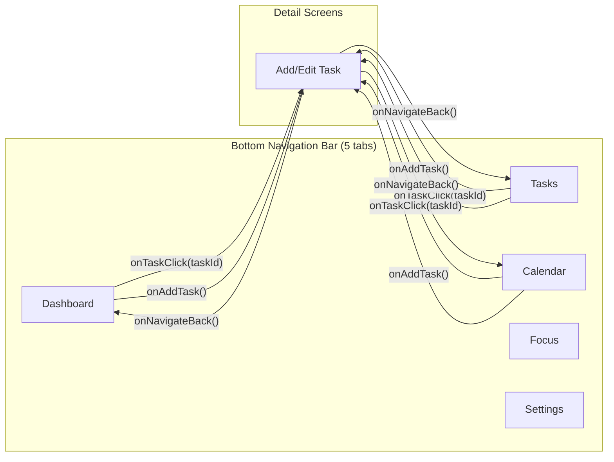

### Route Definitions

| Screen | Route Pattern | Arguments | Type |
|---|---|---|---|
| Dashboard | `dashboard` | — | Bottom Nav |
| Tasks | `tasks` | — | Bottom Nav |
| Calendar | `calendar` | — | Bottom Nav |
| Focus | `focus` | — | Bottom Nav |
| Settings | `settings` | — | Bottom Nav |
| Add/Edit Task | `add_edit_task?taskId={taskId}` | `taskId: String?` (nullable) | Detail |

### Navigation Behavior

- **Start Destination:** `Dashboard`
- **Bottom Nav Transitions:** `fadeIn`/`fadeOut` (200ms tween)
- **Detail Screen Transitions:** `slideInHorizontally` + `fadeIn` (300ms enter), `slideOutHorizontally` + `fadeOut` (300ms exit)
- **Back Stack Management:** `popUpTo(startDestination)` with `saveState = true`, `launchSingleTop = true`, `restoreState = true`
- **Bottom Bar Visibility:** Hidden on detail screens (Add/Edit Task), animated with `slideInVertically`/`slideOutVertically`

---

## 📖 Screens & Pages — Deep Dive

### 1. Dashboard Screen

**Route:** `dashboard`
**Files:** `DashboardScreen.kt`, `DashboardViewModel.kt`

#### What It Shows

```
┌─────────────────────────────────┐
│  Good Morning/Afternoon/Evening │
│  Level X • Y XP                 │
├─────────────────────────────────┤
│  ┌──────┐  ┌────────┬─────────┐ │
│  │ 45%  │  │Due     │Overdue  │ │
│  │Today │  │Today: 3│    : 1  │ │
│  │ Ring │  ├────────┼─────────┤ │
│  │      │  │Done: 2 │Streak:5🔥│ │
│  └──────┘  └────────┴─────────┘ │
├─────────────────────────────────┤
│  Level 3 ████████░░ 45/100 XP   │
├─────────────────────────────────┤
│  "Motivational Quote of Day"    │
├─────────────────────────────────┤
│  ⚠️ Overdue (1)                 │
│  [TaskCard] [TaskCard]          │
├─────────────────────────────────┤
│  📋 Today's Tasks               │
│  [TaskCard] [TaskCard]          │
└─────────────────────────────────┘
             [+ FAB]
```

#### UI Elements

| Element | Description |
|---|---|
| **Greeting** | Time-based: "Good Morning", "Good Afternoon", "Good Evening" |
| **Level & XP Badge** | Shows current level and total XP |
| **Circular Progress Ring** | Today's task completion percentage (animated) |
| **Stat Cards (4)** | Due Today, Overdue, Done, Streak (🔥) |
| **XP Progress Bar** | Linear progress toward next level (X/100 XP) |
| **Motivational Quote** | Rotating daily quote (15 quotes, day-of-year indexed) |
| **Overdue Tasks Section** | Shows top 5 overdue tasks (if any) |
| **Today's Tasks Section** | All tasks due today |
| **FAB** | Floating action button → Add new task |
| **Empty State** | "All clear!" with "Add Task" button when no tasks |

#### Actions & Functions

| Action | ViewModel Function | What Happens |
|---|---|---|
| Tap task card | → navigates to `AddEditTask` | Opens task for editing |
| Complete task (checkbox) | `completeTask(taskId)` | Sets status → `COMPLETED`, records `completedDateMillis`, awards XP, checks achievements |
| Tap FAB (+) | → navigates to `AddEditTask` (no taskId) | Opens blank new task form |

#### Data Sources

| Data | Source | Reactive |
|---|---|---|
| Today's tasks | `TaskRepository.observeTasksForDate()` | ✅ Flow |
| Overdue tasks | `TaskRepository.observeOverdueTasks()` | ✅ Flow |
| Completed today count | `TaskRepository.countCompletedTasksForDate()` | ✅ Flow |
| Total today count | `TaskRepository.countTasksForDate()` | ✅ Flow |
| Streak | `PreferencesManager.currentStreak` | ✅ Flow |
| XP/Level | `PreferencesManager.totalXp` + `GamificationEngine.getLevel()` | ✅ Flow |
| Quote | Hard-coded list, indexed by day of year | Static |

---

### 2. Tasks Screen

**Route:** `tasks`
**Files:** `TasksScreen.kt`, `TasksViewModel.kt`

#### What It Shows

```
┌─────────────────────────────────┐
│  Tasks                   [Sort] │
├─────────────────────────────────┤
│  🔍 Search tasks...             │
├─────────────────────────────────┤
│  [All][Pending][In Progress]    │
│  [Completed][Archived]          │
│  [Work][Personal][Health]...    │
├─────────────────────────────────┤
│  ── 17/06/26 ──                 │
│  [SwipeableTaskCard]            │
│  [SwipeableTaskCard]            │
│  ── 18/06/26 ──                 │
│  [SwipeableTaskCard]            │
│  ── No Due Date ──              │
│  [SwipeableTaskCard]            │
└─────────────────────────────────┘
             [+ FAB]
```

#### UI Elements

| Element | Description |
|---|---|
| **Header** | "Tasks" title with sort dropdown |
| **Search Bar** | Real-time search across title, description, tags |
| **Filter Chips** | Status: All, Pending, In Progress, Completed, Archived |
| **Category Chips** | Dynamic chips from categories table (color-coded) |
| **Task List** | Grouped by due date headers (dd/MM/yy format) |
| **Swipeable Tasks** | Swipe right → Complete, Swipe left → Archive (with haptic feedback, threshold line) |
| **Long Press Menu** | Bottom sheet with: Mark Undone/Complete, Move Category, Archive/Unarchive, Add/Show Notes, Delete |
| **Task Info Dialog** | Preview dialog that opens on "i" button click. Displays notes, note blocks, contacts, attachments, voice notes, and locations in an interactive card list. |
| **Restore Prompt** | Auto-detects backup when task list is empty, offers restore |
| **Permission Dialog** | Requests `POST_NOTIFICATIONS` (API 33+), `READ_EXTERNAL_STORAGE`, or `MANAGE_ALL_FILES_ACCESS` |

#### Sort Options

| Option | Behavior |
|---|---|
| Due Date | Sort by `dueDateMillis` ASC (completed last) |
| Priority | Sort by priority weight DESC (URGENT=4 → LOW=1) |
| Created | Sort by `createdDateMillis` DESC |
| Title | Sort alphabetically by title |

#### Actions & Functions

| Action | ViewModel Function | What Happens |
|---|---|---|
| Search | `setSearchQuery(query)` | Filters tasks by title/description/tags LIKE match |
| Filter by status | `setFilter(filter)` | Switches between ALL, PENDING, IN_PROGRESS, COMPLETED, ARCHIVED |
| Filter by category | `setCategoryFilter(id)` | Filters tasks by `categoryId` |
| Sort | `setSortOption(option)` | Re-sorts current task list |
| Swipe right (60%) | `completeTask(taskId)` | Completes task + Snackbar with "Undo" |
| Swipe left (60%) | `archiveTask(taskId)` | Archives task + Snackbar with "Undo" |
| Tap task | → navigates to `AddEditTask` | Opens task for editing |
| Tap "i" info button | `showTaskDetails(task)` | Opens Task Details Dialog and loads attached task resources and note blocks |
| Toggle checklist item | `toggleDetailsChecklistBlock(id, content)` | Toggles checklist item prefix between `[ ]` and `[x]` in DB |
| Play/Pause voice note | `playVoiceNote(filePath)` | Launches MediaPlayer to play attached voice memos with progress tracking |
| Seek voice note | `seekVoiceNote(position)` | Seeks MediaPlayer playback |
| Close dialog | `hideTaskDetails()` | Releases MediaPlayer and hides details dialog |
| Long press → Mark Undone | `markTaskAsUndone(taskId)` | Sets status → `PENDING`, clears `completedDateMillis` |
| Long press → Move Category | `changeTaskCategory(taskId, categoryId)` | Updates task's `categoryId` |
| Long press → Archive/Unarchive | `archiveTask()`/`unarchiveTask()` | Toggles `ARCHIVED` status |
| Long press → Notes | `updateTaskNotes(taskId, notes)` | Saves/updates task notes |
| Long press → Delete | `deleteTask(taskId)` | Permanently deletes task |
| Restore backup | `restoreBackup()` | Restores from detected backup file |

#### Reactive Filter Pipeline

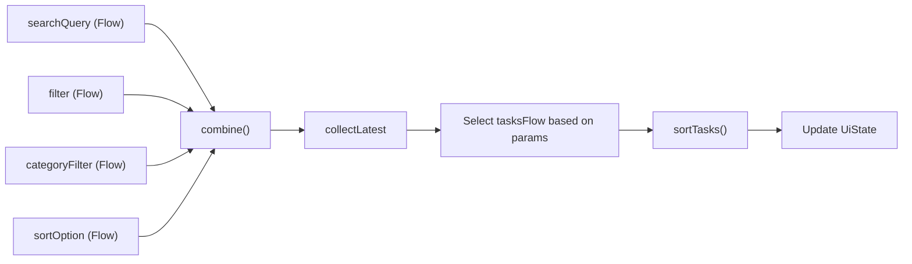

---

### 3. Add/Edit Task Screen

**Route:** `add_edit_task?taskId={taskId}`
**Files:** `AddEditTaskScreen.kt`, `AddEditTaskViewModel.kt`

#### What It Shows

```
┌─────────────────────────────────┐
│ ← New Task / Edit Task   [Save]│
├─────────────────────────────────┤
│  Title *                        │
│  ┌─────────────────────────────┐│
│  │ What needs to be done?     ││
│  └─────────────────────────────┘│
│                                 │
│  Description                    │
│  ┌─────────────────────────────┐│
│  │ Add more details...        ││
│  └─────────────────────────────┘│
│                                 │
│  Priority                       │
│  [Low][Medium][High][Urgent]    │
│                                 │
│  Category                       │
│  [None][Work][Personal][Health] │
│                                 │
│  📅 Set due date        [✕]    │
│                                 │
│  ⏱ Estimated Time (minutes)    │
│                                 │
│  Recurrence                     │
│  [None][Daily][Weekly][Monthly] │
│                                 │
│  🏷 Tags (comma-separated)     │
│                                 │
│  📝 Notes                      │
│                                 │
│  Subtasks                       │
│  ☑ Subtask 1              [✕]  │
│  ☐ Subtask 2              [✕]  │
│  [+ Add subtask...]            │
└─────────────────────────────────┘
```

#### Form Fields

| Field | Required | Input | Validation |
|---|---|---|---|
| Title | ✅ Yes | Text (auto-capitalize) | Must be non-blank to enable Save |
| Description | No | Multi-line text | — |
| Priority | No | Chip group: LOW, MEDIUM, HIGH, URGENT | Default: MEDIUM |
| Category | No | Scrollable chip group from categories | Default: None |
| Due Date | No | Date picker dialog | Can be cleared |
| Estimated Time | No | Number input (minutes) | — |
| Recurrence | No | Chip group: NONE, DAILY, WEEKLY, MONTHLY | Default: NONE |
| Tags | No | Comma-separated text | — |
| Notes | No | Multi-line text | — |
| Subtasks | No | List with checkbox + add input | IME Done adds subtask |
| Task Resources | No | Collapsible summary card (`👤 X  📎 Y  🎤 Z  📍 W`) enclosing sub-panels for Contacts picker, File Provider Attachments, Voice Recorder, and Map Location Links | Validates local file paths exist |
| Note Blocks | No | List editor for rich text blocks: TEXT, CHECKLIST, LINK, QUOTE, and DIVIDER | Supports move up/down ordering |
| Activity Log | No | Timeline of task modification events | Read-only |

#### Actions & Functions

| Action | ViewModel Function | What Happens |
|---|---|---|
| Change title | `updateTitle(title)` | Auto-capitalizes first letter |
| Change description | `updateDescription(desc)` | Auto-capitalizes |
| Set priority | `updatePriority(priority)` | Updates chip selection |
| Set category | `updateCategory(categoryId)` | Updates chip selection |
| Pick date | `updateDueDate(millis)` | Opens Material DatePickerDialog |
| Clear date | `updateDueDate(null)` | Removes due date |
| Set estimated time | `updateEstimatedMinutes(int)` | — |
| Set recurrence | `updateRecurrence(recurrence)` | — |
| Add subtask | `addSubTask(title)` | Appends to subtask list with auto-capitalize |
| Toggle subtask | `toggleSubTask(subTaskId)` | Toggles `isCompleted` |
| Remove subtask | `removeSubTask(subTaskId)` | Removes from list |
| Pick Phone Contact | `onContactPicked(uri, context)` | Direct Phone URI picker (grants temporary read permission to avoid `READ_CONTACTS`) |
| Add manual contact | `addContact(contactPayload)` | Appends contact row to state list |
| Attach file | `addAttachmentFromUri(uri, context)` | Copies provider Uri file to internal app storage directory and saves path reference |
| Record Voice note | `startRecording(context)` / `stopRecording(context)` | Controls `MediaRecorder` audio recording to `files/voice_notes/` |
| Manage Note Block | `addNoteBlock(type)` / `updateNoteBlockContent(id, text)` / `moveNoteBlock(from, to)` | Updates note blocks collection and layout order |
| Save | `saveTask()` | Persists task entity first, tracks modification details against old database values to emit timeline events, then saves subtasks, note blocks, and resources in a transaction |
| Back arrow | `onNavigateBack()` | Pops back stack (no save) |

#### Save Logic Flow

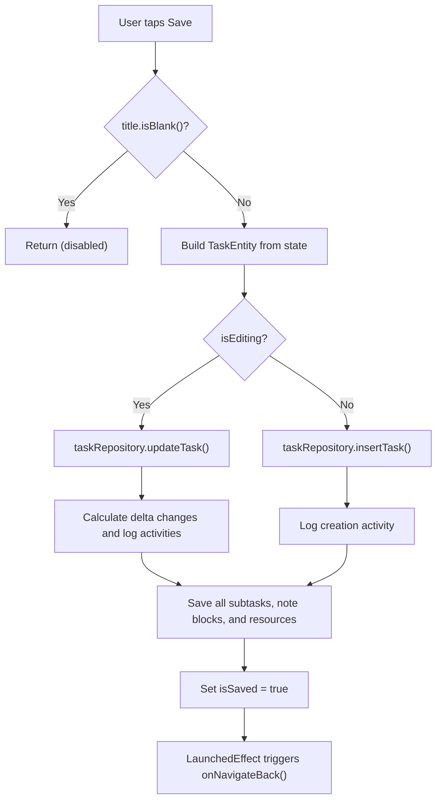

---

### 4. Calendar Screen

**Route:** `calendar`
**Files:** `CalendarScreen.kt`, `CalendarViewModel.kt`

#### What It Shows

```
┌─────────────────────────────────┐
│  [<]    June 2026        [>]    │
├─────────────────────────────────┤
│  Sun Mon Tue Wed Thu Fri Sat    │
│       1   2   3   4   5   6    │
│   7   8   9  10  11  12  13    │
│  14  15  16 [17] 18  19  20    │
│  21  22  23  24  25  26  27    │
│  28  29  30                     │
│         (dots indicate tasks)   │
├─────────────────────────────────┤
│  📋 Today / Tomorrow / Jun 18  │
├─────────────────────────────────┤
│  [TaskCard]                     │
│  [TaskCard]                     │
└─────────────────────────────────┘
             [+ FAB]
```

#### UI Elements

| Element | Description |
|---|---|
| **Month Header** | "MMMM yyyy" with chevron prev/next buttons |
| **Day-of-Week Row** | Sun Mon Tue Wed Thu Fri Sat |
| **Calendar Grid** | Space-optimized grid (1.5f aspect ratio), today highlighted (border), selected day filled (Primary) |
| **Task Density Dots** | Up to 3 dots per day cell indicating task count |
| **Sticky Date Header** | Pinned header displaying selected date, tasks count, and completion rate while scrolling |
| **Day Agenda** | Scrollable tasks for selected day below the calendar |
| **Collapsible No Due Date Section** | Integrated collapsible `📥 No Due Date` list section at the bottom of the list container |
| **Empty State** | "No tasks planned / Day is clear" inline with list |
| **FAB** | Single primary FAB to add new task |

#### Actions & Functions

| Action | ViewModel Function | What Happens |
|---|---|---|
| Tap day cell | `selectDay(dayOfMonth)` | Updates `selectedDayMillis`, reloads tasks for that day |
| Navigate month (← →) | `navigateMonth(-1/+1)` | Changes `currentYear`/`currentMonth`, reloads month task counts |
| Complete task | `completeTask(taskId)` | Completes task + awards XP |
| Tap task card | → navigates to `AddEditTask` | Opens task for editing |
| Tap FAB | → navigates to `AddEditTask` | Opens blank new task form |

#### Calendar Grid Logic

- `firstDayOfWeek`: Fixed to Sunday (`firstDayOfWeek = Calendar.SUNDAY`) in both Month and Week views to stabilize layout boundaries across all system locales.
- `daysInMonth`: Actual days in month
- `totalCells`: `firstDayOfWeek + daysInMonth`
- `rows`: `ceil(totalCells / 7)`
- **Today**: Blue border, bold text
- **Selected**: Solid blue background, white text
- **Task dots**: Up to 3 colored dots below day number

---

### 5. Focus Screen

**Route:** `focus`
**Files:** `FocusScreen.kt`, `FocusViewModel.kt`

#### What It Shows

```
┌─────────────────────────────────┐
│            Focus                │
│       Pomodoro ⏱️ / Break ☕    │
│     Ends at 10:25 PM            │
├─────────────────────────────────┤
│  [Pomodoro]  [Deep Work]        │
│              [Break Active]     │
├─────────────────────────────────┤
│         ┌────────────┐          │
│         │   25:00    │          │
│         │Stay focused│          │
│         │Tap to change│         │
│         └────────────┘          │
│    [−5 min] [+5 min] [+10 min]  │
├─────────────────────────────────┤
│    [Reset]  [▶ Play/⏸ Pause]   │
│                       [Skip ⏭]  │
├─────────────────────────────────┤
│  [Sessions] [Today]  [Total]    │
│     12      45m      8h         │
└─────────────────────────────────┘
```

#### Timer States & Transitions

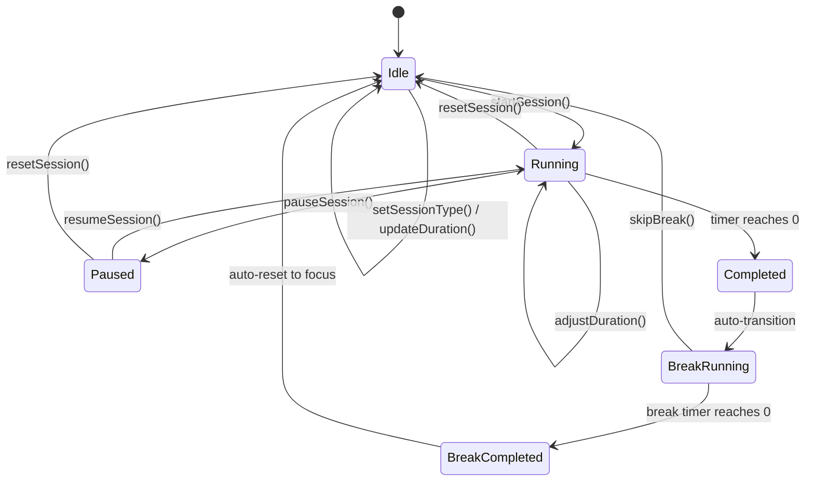

#### Session Types

| Type | Default Duration | Configurable Range |
|---|---|---|
| **Pomodoro** | 25 min | 5–60 min (Settings slider) |
| **Deep Work** | 90 min | 30–180 min (Settings slider) |
| **Break** | 5 min | 1–30 min (Settings slider) |

#### Actions & Functions

| Action | ViewModel Function | What Happens |
|---|---|---|
| Switch session type | `setSessionType(type)` | Changes to Pomodoro/Deep Work (only when idle) |
| Start | `startSession()` | Starts `CountDownTimer`, calculates end time, silences active alarm |
| Pause | `pauseSession()` | Cancels timer, saves remaining seconds, silences active alarm |
| Resume | `resumeSession()` | Restarts timer from remaining seconds |
| Reset | `resetSession()` | Resets to full duration, silences active alarm |
| Long press Reset | `completeSessionReset()` | Full reset back to Pomodoro defaults, silences active alarm |
| Skip Break | `skipBreak()` | Skips break, returns to focus mode, silences active alarm |
| Stop Sound | `stopSound()` | Immediately stops and releases the active MediaPlayer sound player |
| ±5/10 min chips | `adjustDuration(±5/±10)` | Adjusts duration mid-session, saves to preferences |
| Tap timer ring | Shows `ModalBottomSheet` | Duration picker with presets (15/25/30/45/60/90) and custom slider (1–120 min) |
| Apply custom duration | `updateDuration(minutes)` | Sets new duration, saves to preferences |

#### On Session Complete

1. Creates `FocusSessionEntity` with `isCompleted = true`
2. Saves to database via `focusRepository.insertSession()`
3. Awards XP: `1 XP per minute` via `gamificationEngine.awardFocusSessionXp()`
4. Plays custom audio file `focus_finished` dynamically using `MediaPlayer` (sets `isSoundPlaying = true`)
5. Renders a "Stop Sound" button on screen, allowing users to manually dismiss the alarm
6. Auto-transitions to Break mode with break duration

#### Visual Features

- **Animated Ring Color:** Lerps from `Primary` → `Accent` as progress increases (via `animateColorAsState`)
- **Haptic Feedback:** On tap timer ring, adjust duration chips, duration picker
- **End Time Display:** Shows calculated end time (e.g., "10:25 PM") while running

#### Stats (Bottom of Screen)

| Stat | Source |
|---|---|
| Sessions (total completed) | `focusRepository.observeTotalSessionCount()` |
| Today (focus minutes) | `focusRepository.observeFocusMinutesForDate()` |
| Total (hours) | `focusRepository.observeTotalFocusMinutes()` |

---

### 6. Settings Screen

**Route:** `settings`
**Files:** `SettingsScreen.kt`, `SettingsViewModel.kt`

#### Sections

```
┌─────────────────────────────────┐
│  Settings                       │
├── APPEARANCE ───────────────────┤
│  Theme: [Light] [Dark] [System] │
├── TIMER SETTINGS ───────────────┤
│  Pomodoro Duration ━━━━━ 25 min │
│  Break Duration    ━━━━━  5 min │
│  Deep Work Duration━━━━━ 90 min │
├── NOTIFICATIONS ────────────────┤
│  Enable Notifications    [ON]   │
│  ○ Summary Notifications        │
│  ● Individual Task Notifications│
├── CATEGORIES ───────────────────┤
│  ● Work              (system)   │
│  ● Personal          (system)   │
│  ● Health            (system)   │
│  ● Custom Cat        [Delete]   │
│                          [+ Add]│
├── ACHIEVEMENTS ─────────────────┤
│  🏆 First Step    ✓ Unlocked    │
│  🔒 Week Warrior  (locked)      │
│  🔒 Monthly Master (locked)     │
├── BACKUP & RESTORE ─────────────┤
│  ┌ Backup Health Status ────┐   │
│  │ ✓ Last Backup Successful │   │
│  │ Last: Jun 17, 2026       │   │
│  │ Stored: 3/10             │   │
│  │ Size: 0.05 MB            │   │
│  │ Auto: Daily Enabled      │   │
│  └──────────────────────────┘   │
│  [Create Local Backup Now]      │
│  [Export Backup File (SAF)]     │
│  [Import Backup File (SAF)]    │
│  Backup History:                │
│    📄 mustdo_backup_20260617... │
├── STATS ────────────────────────┤
│  Total XP:        450           │
│  Level:           4             │
│  Current Streak:  5 days        │
│  Longest Streak:  12 days       │
├── DANGER ZONE ──────────────────┤
│  [🗑 Reset All Data]            │
└─────────────────────────────────┘
```

#### Settings Actions

| Section | Action | ViewModel Function | What Happens |
|---|---|---|---|
| **Appearance** | Select theme | `setThemeMode(mode)` | Saves to DataStore, `MainActivity` recomposes with new theme |
| **Timer** | Drag slider | `setPomodoroDuration/setBreakDuration/setDeepWorkDuration` | Persists to DataStore, focus screen reads reactively |
| **Notifications** | Toggle master switch | `setNotificationsEnabled(bool)` | Saves to DataStore |
| **Notifications** | Select mode | `setNotificationMode(mode)` | `SUMMARY`: one grouped notification; `INDIVIDUAL`: per-task notifications |
| **Categories** | Add | `addCategory(name, colorHex)` | Creates new `CategoryEntity` with selected color |
| **Categories** | Delete | `deleteCategory(category)` | Removes (only non-system categories); FK SET_NULL on tasks |
| **Backup** | Create local | `createManualBackup()` | Calls `backupManager.performAutoBackup()`, saves to `Downloads/MustDo/Backups/` |
| **Backup** | Export SAF | `exportBackup(context, uri)` | Exports JSON via SAF file picker |
| **Backup** | Import SAF | `loadImportPreview(uri)` → `confirmImportRestore()` | Preview dialog → restore with validation + emergency rollback |
| **Backup** | Tap history item | `loadImportPreview(uri)` | Shows restore preview dialog |
| **Stats** | — | Read-only | Displays XP, Level, Streak from DataStore |
| **Danger Zone** | Reset All | `showResetConfirm()` → `resetAllData()` | Confirmation dialog → deletes all tasks, sessions, achievements, preferences |

#### Category Color Picker

Available colors: `#6C63FF`, `#FF6B6B`, `#51CF66`, `#FFD43B`, `#22D3EE`, `#FF922B`, `#A855F7`, `#F472B6`

---

## 🎮 Gamification System

### XP System

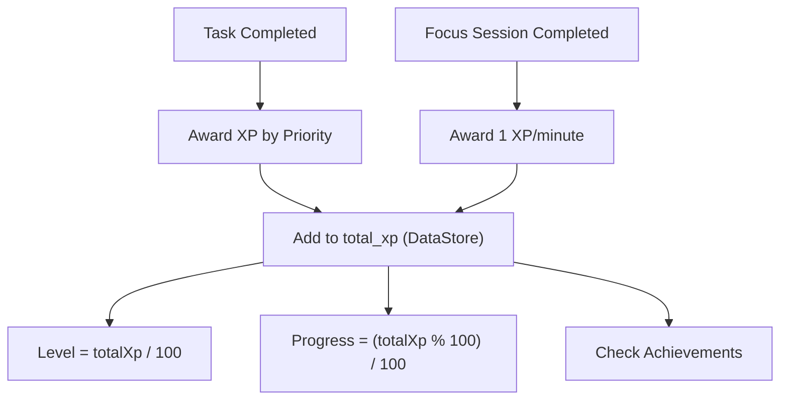

### XP Rewards by Priority

| Priority | XP Awarded |
|---|---|
| LOW | 10 XP |
| MEDIUM | 15 XP |
| HIGH | 20 XP |
| URGENT | 25 XP |

### Leveling

- **Formula:** `Level = totalXp / 100`
- **Progress:** `XP Progress = (totalXp % 100) / 100`
- Every 100 XP = 1 level up

### Streak System

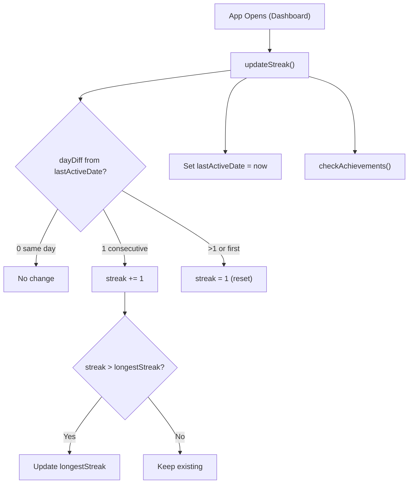

### Achievement Checks

Automatically checked after:
- Every task completion
- Every focus session completion
- Every streak update
- Every XP award

| Condition Type | What's Checked |
|---|---|
| `TASKS_COMPLETED` | Direct count check via `checkFirstTaskAchievement()` |
| `STREAK` | `currentStreak >= conditionValue` |
| `LEVEL` | `getLevel(totalXp) >= conditionValue` |
| `FOCUS_SESSIONS` | `totalSessionCount >= conditionValue` |

---

## 🔔 Notification System

### Architecture

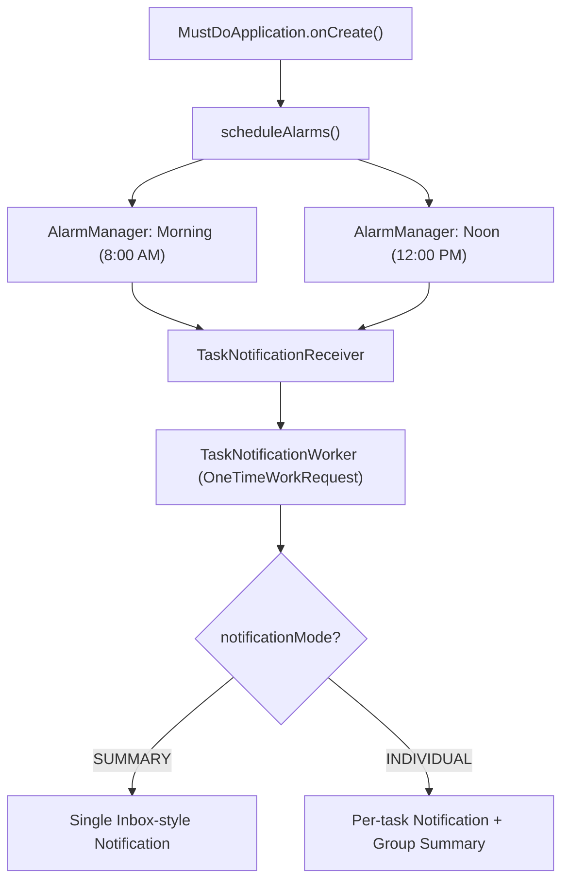


### Notification Modes

| Mode | Behavior |
|---|---|
| **Summary** | One notification with `InboxStyle` listing all pending tasks. Actions: Complete top task, Snooze to Noon (morning only) |
| **Individual** | Separate notification per task with actions: Complete, Archive, Open. Plus a group summary notification |

> [!NOTE]
> For individual task reminder and daily agenda notifications, if the task has an associated **Voice Note** resource, the suffix ` | 🎤 Voice Note Attached` is automatically appended to the notification's details/content text to highlight the audio memo.

### Notification Actions (from notification itself)

| Action | Broadcast Intent | What Happens |
|---|---|---|
| **Complete** | `ACTION_COMPLETE_TASK` | Sets task status → COMPLETED, dismisses notification |
| **Archive** | `ACTION_ARCHIVE_TASK` | Sets task status → ARCHIVED, dismisses notification |
| **Open Task** | Opens `MainActivity` with `extra_task_id` | Navigates to task in app |
| **Do at Noon** (morning only) | `ACTION_SNOOZE_TO_NOON` | Reschedules alarm for noon, dismisses morning notification |

### Channel

- **ID:** `daily_tasks_reminders_channel`
- **Name:** "Daily Tasks Reminders"
- **Importance:** DEFAULT
- **Vibration:** Enabled

---

## 💾 Backup & Restore System

### Backup Architecture

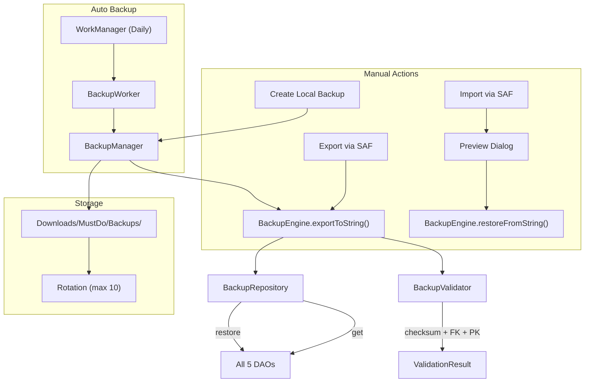

### Backup Formats & Schema History

| Backup Version | App Version | Format | Contents & Migration Path |
|---|---|---|---|
| **v1** | v1.0 | `.json` file | Plain JSON payload including tasks, subtasks, categories, focus sessions, achievements, and settings. |
| **v2** | v1.1 | `.json` file | Plain JSON payload. Migrates v1 → v2 by auto-generating explicit `TaskReminderEntity` records for any pending task with a reminder timestamp. |
| **v3 (Latest)** | v1.2 | `.zip` archive | ZIP bundle containing: <br>• `backup.json` (Room database records + settings)<br>• `/attachments/` (User-uploaded files copied from internal storage)<br>• `/voice/` (Recorded `.m4a`/`.aac` voice memos)<br><br>Migrates v2 → v3 by initializing empty resource, note block, and activity logs tables in `BackupMigrationManager`. |

### Backup Payload Structure (`backup.json` / v3 JSON)

```json
{
  "version": 3,
  "appVersion": "1.2",
  "createdAt": 1718644800000,
  "checksum": "sha256...",
  "settings": {
    "themeMode": "SYSTEM",
    "pomodoroDuration": 25,
    "breakDuration": 5,
    "deepWorkDuration": 90,
    "notificationsEnabled": true,
    "dailyReminderEnabled": false,
    "dailyReminderTime": "09:00",
    "totalXp": 450,
    "currentStreak": 5,
    "longestStreak": 12,
    "lastActiveDate": 1718644800000,
    "isFirstLaunch": false
  },
  "categories": [...],
  "tasks": [...],
  "subTasks": [...],
  "focusSessions": [...],
  "achievements": [...],
  "reminders": [...],
  "resources": [
    {
      "id": "uuid",
      "taskId": "task_uuid",
      "resourceType": "VOICE_NOTE",
      "payloadJson": "{\"filePath\":\".../voice_notes/voice_123.m4a\",\"durationMs\":5000}",
      "createdAt": 1718644800000
    }
  ],
  "noteBlocks": [
    {
      "id": "uuid",
      "taskId": "task_uuid",
      "blockType": "TEXT",
      "content": "Rich text note block",
      "position": 0,
      "createdAt": 1718644800000
    }
  ],
  "activities": [
    {
      "id": "uuid",
      "taskId": "task_uuid",
      "activityType": "CREATE",
      "details": "Task created",
      "timestamp": 1718644800000
    }
  ]
}
```

### Backup Validation Steps

1. **JSON Parse Check** — Valid JSON structure (extracted from `backup.json` in ZIP archives).
2. **Checksum Verification** — SHA-256 integrity check matching the payload's `checksum` property.
3. **Primary Key Uniqueness** — Checks for duplicate IDs in tasks, categories, and resources.
4. **Foreign Key Integrity** — All `categoryId` and `taskId` references resolve correctly.
5. **Version Migration** — `BackupMigrationManager` migrates older payloads incrementally to the current version.

### Restore Safety

1. **Pre-restore Emergency Backup** — Current data (including files if importing a ZIP) is saved to a cache file or private backup location.
2. **Database Transaction** — All database restore actions occur inside a single Room transaction.
3. **Post-restore Verification** — Re-verifies all foreign key and primary key integrity constraints after import.
4. **Rollback on Failure** — If any verification or insertion fails, the emergency backup is automatically restored, ensuring no data loss.
5. **File Extraction** — When restoring from a ZIP backup, the attachments and voice notes directories are temporary extracted to cache, database is verified/restored, and then files are copied to internal directories (`task_attachments/` and `voice_notes/`).

### Storage Management

- **Local Storage Location:** `Downloads/MustDo/Backups/`
- **File Format:** 
  - Legacy: `mustdo_backup_yyyyMMdd_HHmmss.json` (v1/v2 plain JSON)
  - Current: `backup_yyyy_MM_dd_HH_mm.zip` (ZIP package containing database JSON and media files)
- **Rotation:** Maximum 7 backups kept locally, oldest deleted automatically.
- **Auto-backup:** Daily periodic backup executed by `BackupWorker` via WorkManager (runs with storage-not-low constraint).

---

## 💉 Dependency Injection (Hilt)

### Module Structure

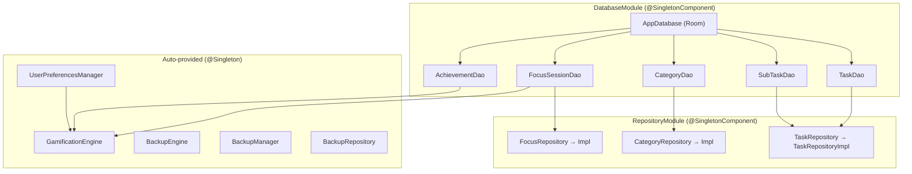

### Database Seeding

On first database creation (`RoomDatabase.Callback.onCreate`):
- **5 default categories** are inserted (Work, Personal, Health, Learning, Finance)
- **6 default achievements** are inserted (First Step, Week Warrior, Monthly Master, Rising Star, Productivity Pro, Focus Master)

---

## 🎨 Theming System

### Theme Modes

| Mode | Behavior |
|---|---|
| `LIGHT` | Forces light color scheme |
| `DARK` | Forces dark color scheme |
| `SYSTEM` | Follows device system setting |

### Color Palette

```
Primary:       #6C63FF (Indigo-violet)
Accent:        #FF6B6B (Coral red)
Success:       #51CF66 (Green)
Warning:       #FFD43B (Amber)
Info:          #22D3EE (Cyan)

Priority Low:    #51CF66 (Green)
Priority Medium: #FFD43B (Amber)
Priority High:   #FF922B (Orange)
Priority Urgent: #FF6B6B (Red)

Dark BG:       #0A0A0F
Dark Surface:  #111118
Light BG:      #F8F9FC
Light Surface: #FFFFFF
```

### Theme Application

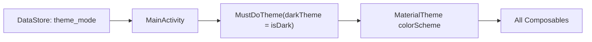

---

## 🧩 Reusable UI Components

All defined in `CommonComponents.kt`:

| Component | Props | Description |
|---|---|---|
| `TaskCard` | task, onTaskClick, onCompleteClick, categoryName?, categoryColor?, onLongClick? | Task display card with priority indicator, due date, category badge, completion checkbox |
| `StatCard` | label, value, icon, color, modifier | Small stat display card (used in Dashboard & Focus) |
| `CircularProgressRing` | progress, strokeWidth, progressColor, trackColor, content | Animated circular progress indicator with center content |
| `SectionHeader` | title, modifier, trailing? | Section title with optional trailing action |
| `EmptyState` | icon, title, subtitle, modifier, action? | Empty content placeholder with optional action button |

---

## ⚙️ Background Workers

| Worker | Schedule | Constraints | Purpose |
|---|---|---|---|
| `BackupWorker` | Periodic: every 24 hours | `requiresStorageNotLow = true` | Automated daily backup to Downloads |
| `StreakCheckWorker` | — | — | Validates and updates streak data |
| `TaskNotificationWorker` | One-time (via AlarmManager) | — | Sends morning (8 AM) and noon (12 PM) task reminders |

### Worker Registration

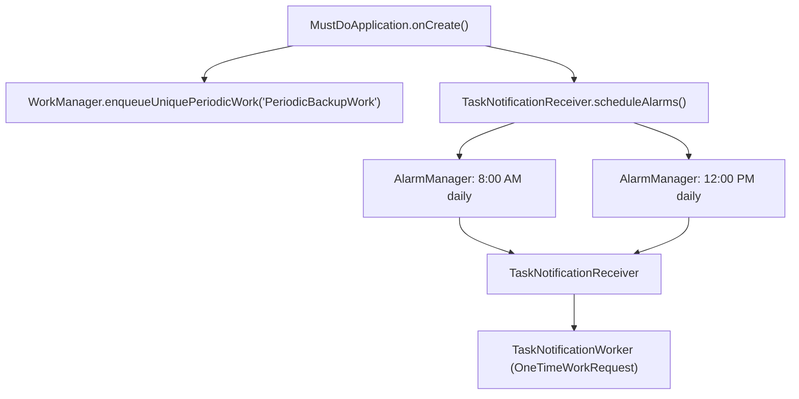

### HiltWorkerFactory

The app uses `HiltWorkerFactory` via `Configuration.Provider` on `MustDoApplication` to inject dependencies into workers.

---

## 🔄 Complete Data Flow Diagram

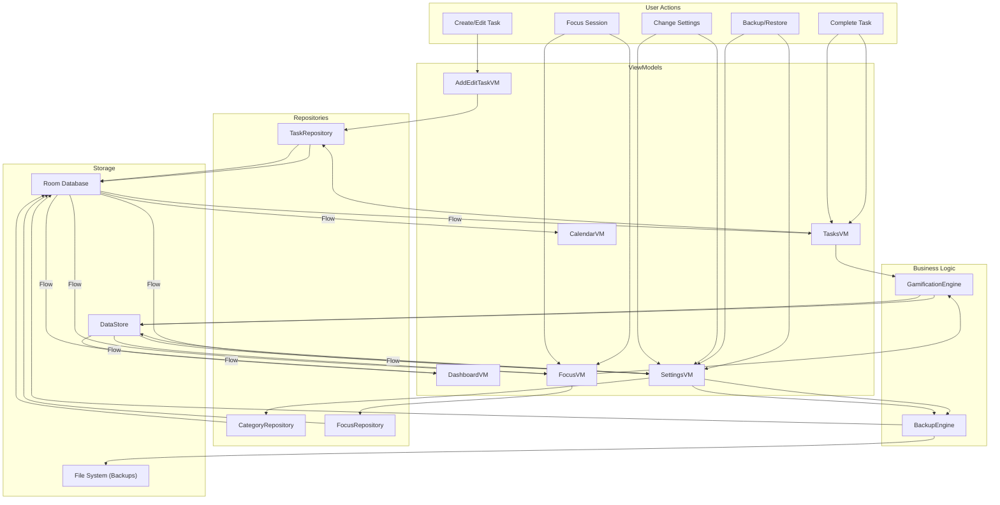

---

## 📊 Screen Navigation Flow Summary

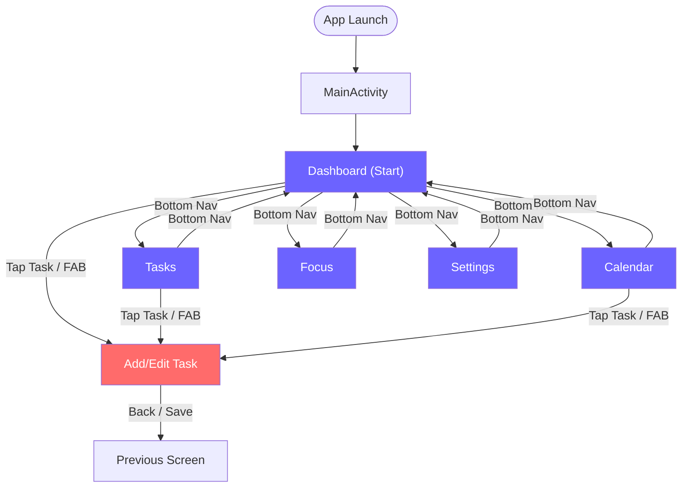

---

## 📋 Complete Action Reference Table

| Screen | User Action | Function Called | DB Effect | Side Effects |
|---|---|---|---|---|
| Dashboard | Complete task | `completeTask(id)` | Task status → COMPLETED | +XP, check achievements |
| Dashboard | Add task | Navigate to AddEditTask | — | — |
| Tasks | Search | `setSearchQuery(q)` | — | Filters displayed list |
| Tasks | Filter status | `setFilter(f)` | — | Filters displayed list |
| Tasks | Filter category | `setCategoryFilter(id)` | — | Filters displayed list |
| Tasks | Sort | `setSortOption(opt)` | — | Re-sorts displayed list |
| Tasks | Swipe right | `completeTask(id)` | Task → COMPLETED | +XP, Snackbar + Undo |
| Tasks | Swipe left | `archiveTask(id)` | Task → ARCHIVED | Snackbar + Undo |
| Tasks | Long press → Undone | `markTaskAsUndone(id)` | Task → PENDING | — |
| Tasks | Long press → Move | `changeTaskCategory(id, catId)` | Update categoryId | — |
| Tasks | Long press → Delete | `deleteTask(id)` | DELETE task | Cascades subtasks |
| Tasks | Long press → Notes | `updateTaskNotes(id, text)` | Update notes | — |
| Tasks | Restore backup | `restoreBackup()` | Full restore | Toast message |
| AddEdit | Save (new) | `saveTask()` | INSERT task + subtasks | Navigate back |
| AddEdit | Save (edit) | `saveTask()` | UPDATE task + subtasks | Navigate back |
| Calendar | Select day | `selectDay(day)` | — | Loads tasks for day |
| Calendar | Navigate month | `navigateMonth(±1)` | — | Reloads month data |
| Calendar | Complete task | `completeTask(id)` | Task → COMPLETED | +XP |
| Focus | Start session | `startSession()` | — | Starts CountDownTimer |
| Focus | Pause | `pauseSession()` | — | Cancels timer |
| Focus | Resume | `resumeSession()` | — | Restarts from remaining |
| Focus | Reset | `resetSession()` | — | Resets to full duration |
| Focus | Complete (auto) | `completeSession()` | INSERT FocusSession | +XP, auto-start break |
| Focus | Skip break | `skipBreak()` | — | Returns to focus mode |
| Focus | Adjust ±5/10 | `adjustDuration(δ)` | — | Saves pref, restarts timer if running |
| Settings | Change theme | `setThemeMode(m)` | DataStore | Theme recomposition |
| Settings | Adjust timers | `setPomodoro/Break/DeepWork` | DataStore | Focus screen reads reactively |
| Settings | Toggle notifications | `setNotificationsEnabled(b)` | DataStore | — |
| Settings | Add category | `addCategory(name, hex)` | INSERT category | Available in task forms |
| Settings | Delete category | `deleteCategory(cat)` | DELETE category | Tasks → categoryId = null |
| Settings | Create backup | `createManualBackup()` | — | Writes JSON to Downloads |
| Settings | Export SAF | `exportBackup(ctx, uri)` | — | Writes to user-selected file |
| Settings | Import SAF | `loadImportPreview(uri)` → `confirmImportRestore()` | Full restore | Emergency backup + rollback safety |
| Settings | Reset all | `resetAllData()` | DELETE all data | Clears DataStore |

---

> **Last Updated:** June 17, 2026
> **Generated from source code analysis of MustDo v1.0**
