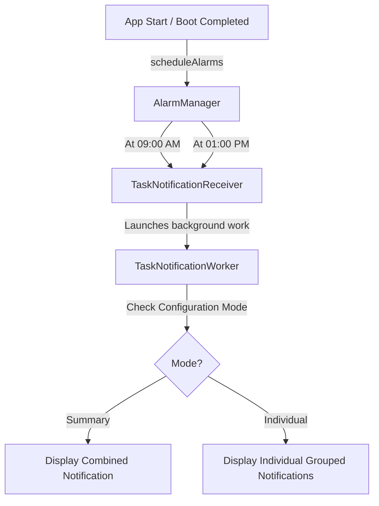

# Notification System Architecture & Workflow

This document details the scheduling, triggering, rendering, and action handling workflow of the notification system in the MustDo ToDo application.

---

## 1. High-Level Architecture

The notification system utilizes Android's `AlarmManager` for precise scheduling, `BroadcastReceiver` for handling alarm events and notification actions, and Jetpack `WorkManager` for background queries to the database and building/dispatching the final notifications.

---

## 2. Notification Schedule & Trigger Flow

The application issues reminders to keep the user updated on their pending tasks for the day:

* **Morning Task Reminder (🌅)**: Everyday at **09:00 AM**
* **Noon Task Reminder (☀️)**: Everyday at **01:00 PM** (13:00)

When either alarm triggers:
1. `AlarmManager` sends a broadcast which is intercepted by `TaskNotificationReceiver`.
2. `TaskNotificationReceiver` launches the `TaskNotificationWorker` using Jetpack `WorkManager`.
3. The worker queries all pending and overdue tasks.
4. The rendering depends on the user-configured **Notification Mode**.

---

## 3. Configurable Notification Modes

Users can customize how notifications are delivered under **Settings → Notifications → Notification Mode**:

### A. Summary Notifications (Default)
In this mode, a single aggregated notification summary is displayed:
* **Displays**: Total pending tasks count, overdue task count, and a preview of the top pending tasks.
* **Notification IDs**: Morning uses ID `2001`, Noon uses ID `2002`.
* **Actions**:
  * **Open App**: Launches `MainActivity`.
  * **Complete (Quick Action)**: Completes the first pending task.
  * **Do at Noon (Snooze)**: Reschedules the alarm to 1:00 PM (available on morning reminders).

### B. Individual Task Notifications
In this mode, every pending and overdue task triggers its own notification:
* **Displays**: Task title, due date, priority level, and category name (if assigned).
* **Notification IDs**: Uses the unique hashcode of the task's ID (`task.id.hashCode()`).
* **Android Notification Grouping**: All individual notifications are grouped under a single parent group summary (`com.example.todo.TASK_GROUP`) in the notification drawer with title `📋 [Count] Pending Tasks` to avoid drawer clutter.
* **Actions**:
  * **Complete**: Marks this specific task as complete in the database and cancels only this notification.
  * **Archive**: Marks this specific task as archived in the database and cancels only this notification.
  * **Open Task**: Launches the app directly focusing on this task.

---

## 4. Interactive Action Receiver Handlers

All actions in notification buttons are processed via `TaskNotificationReceiver`:

* **`com.example.todo.action.COMPLETE_TASK`**:
  Queries the database in a background coroutine and sets task status to `COMPLETED`, then cancels the corresponding notification ID.
* **`com.example.todo.action.ARCHIVE_TASK`**:
  Queries the database in a background coroutine and sets task status to `ARCHIVED`, then cancels the corresponding notification ID.
* **`com.example.todo.action.SNOOZE_TO_NOON`**:
  Sets a one-shot alarm for 1:00 PM today via `AlarmManager` and cancels the morning notification.
